# Error Class Hierarchy

**Title**: Error Class Hierarchy

**Authors**: Warren James, Andy Mina

**Advisory Group**: Daria Purdue, Eric Adum, Neal Beeken

### Contents

- [Introduction](#Introduction)
- [Errors](#errors)
  - [`MongoError`](#MongoError)
  - [`MongoDriverError`](#MongoDriverError)
    - [`MongoAPIError`](#MongoAPIError)
    - [`MongoRuntimeError`](#MongoRuntimeError)
  - [`MongoNetworkError`](#MongoNetworkError)
  - [`MongoServerError`](#MongoServerError)
  - [`MongoSystemError`](#MongoSystemError)
- [Test Plan](#Test-Plan)
  - [`MongoAPIError`](#MongoAPIError-1)
    - [`MongoInvalidArgumentError`](#MongoInvalidArgumentError-1)
    - [`MongoMissingCredentialsError`](#MongoMissingCredentialsError-1)
  - [`MongoRuntimeError`](#MongoRuntimeError-1)
    - [`MongoNotConnectedError`](#MongoNotConnectedError-1)
    - [`MongoServerClosedError`](#MongoServerClosedError-1)
    - [`MongoStreamClosedError`](#MongoStreamClosedError-1)
    - [`MongoTopologyClosedError`](#MongoTopologyClosedError-1)
    - [`MongoCursorExhaustedError`](#MongoCursorExhaustedError-1)
  - [`MongoNetworkError`](#MongoNetworkError-1)
    - [`MongoNetworkTimeoutError`](#MongoNetworkTimeoutError-1)

# Errors

All errors are derived from the `MongoError` class which should **never** be instantiated.
There are four main error classes which stem from `MongoError`: `MongoDriverError`, `MongoNetworkError`, `MongoServerError`, and `MongoSystemError`.

## `MongoError`

The base class from which all errors in the Node driver subclass.
`MongoError` should **never** be be directly instantiated.

Children of `MongoError` include:

- [`MongoDriverError`](#MongoDriverError)
- [`MongoNetworkError`](#MongoNetworkError)
- [`MongoServerError`](#MongoServerError)
- [`MongoSystemError`](#MongoSystemError)

## `MongoDriverError`

This class represents errors which originate in the driver itself or in the user's use of the driver.
This class should **never** be directly instantiated.
Its children are the main classes of errors that most users will interact with: [**`MongoAPIError`**](#MongoAPIError) and [**`MongoRuntimeError`**](#MongoRuntimeError).

### `MongoAPIError`

This class represents errors which originate from misuse of the driver API and will generally be thrown before making contact with the server.
This class should **never** be directly instantiated.

Children of `MongoAPIError` include:

- #### `MongoInvalidArgumentError`

  - Thrown when the user supplies malformed, unexpected arguments or failed to provide a required argument or field.

- #### `MongoCompatibilityError`

  - Thrown when a feature that is not enabled or allowed for the current server configuration is used.

- #### `MongoMissingCredentialsError`

  - Thrown when a user fails to provide authentication credentials before attempting to connect to the mongo server.

- #### `MongoMissingDependencyError`
  - Thrown when a required module or dependency is not present.

### `MongoRuntimeError`

This class represents errors which occur when the driver encounters unexpected input or reaches an unexpected/invalid internal state.
This class should **never** be directly instantiated.

_MongoRuntimeError children (pt 1)_

_MongoRuntimeError children (pt 2)_

_MongoRuntimeError children (pt 3)_

Children of `MongoRuntimeError` include:

- #### `MongoTransactionError`

  - Thrown when the user makes a mistake in the usage of transactions (e.g.: attempting to commit a transaction with a readPreference other than primary).

- #### `MongoNotConnectedError`

  - Thrown when the user attempts to operate on the data from a client that has not been connected to a MongoDB server instance.

- #### `MongoKerberosError`

  - Thrown when the user attempts to authenticate via Kerberos, but fails to connect to the Kerberos client.

- #### `MongoCompressionError`

  - Thrown when the driver fails to compress data before sending it to the server.

- #### `MongoDecompressionError`

  - Thrown when the driver fails to decompress data received from the server

- #### `MongoExpiredSessionError`

  - Thrown when the user attempts to operate on a session that has expired or has been closed.

- #### `MongoURIError`

  - Thrown when a user supplies an incorrect URI to the driver.

- #### `MongoResourceClosedError`

  - Thrown when there is an attempt to access a resource which has already been or will be closed/destroyed.
    - Children of this error class include:
      - **`MongoServerClosedError`**: Thrown when an attempt is made to operate on a closed server.
      - **`MongoStreamClosedError`**: Thrown when an attempt is made to operate on a closed stream.
      - **`MongoTopologyClosedError`**: Thrown when an attempt is made to operate on a dropped, or otherwise unavailable, database.

- #### `MongoCursorError`

  - Thrown when the user incorrectly uses a cursor object.
    - Children of this error class include:
      - **`MongoTailableCursorError`**: Thrown when the user calls a function or method that is not supported on a tailable cursor.
      - **`MongoCursorInUseError`**: Thrown when the user attempts to add options to an already initialized cursor.
      - **`MongoCursorExhaustedError`**: Thrown when an attempt is made to read from a cursor that has been exhausted.

- #### `MongoStreamError`

  - Thrown when a stream operation fails to execute.
  - Children of this error class include:
    - **`MongoChangeStreamError`**: Thrown when an error is encountered when operating on a ChangeStream.
    - **`MongoGridFSStreamError`**: Thrown when an unexpected state is reached when operating on a GridFSStream.
    - **`MongoGridFSChunkError`**: Thrown when a malformed or invalid chunk is encountered when reading from a GridFSStream.

- #### `MongoBatchReExecutionError`

  - Thrown when a user attempts to reexecute a batch command when one of the constituent commands has failed.

- #### `MongoServerSelectionError`

  - Thrown when the driver fails to select a server to complete an operation.

## `MongoNetworkError`

These are errors which prevent the driver from connecting to a mongo server instance. Children of this class include:

- #### `MongoNetworkTimeoutError`

  - Thrown when a timeout expires while attempting to connect to the mongo server

## `MongoServerError`

These are errors which wrap error responses received from the server.

## `MongoSystemError`

These are errors which originate from faulty environment setup.

# Test Plan

The test plan consists of a series of prose tests.
As numerous errors are being introduced, select classes will be tested.
The classes to be tested will be selected based on two characteristics:

1. The **frequency** with which users may encounter this error. Errors that users will likely run into, including but not limited to `MongoInvalidArgumentError` and `MongoNetworkTimeoutError`, are a part of the test plan. _Note:_ Error classes that should never be instantiated, such as `MongoAPIError` and `MongoRuntimeError`, will not be tested as the user should not encounter them.
2. The **scope** of the error. Errors that tackle a large subset of issues, including but not limited to `MongoServerError` and `MongoSystemError`, will _not_ be a part of the test plan.
3. The **existing coverage** of the error. Errors that are already covered in existing tests will _not_ be a part of the test plan to avoid redundancy.

## `MongoAPIError`

#### `MongoInvalidArgumentError`

- Create a `MongoClient` object and supply a number in place of the connection string when calling `.connect()`
  - Assert that `MongoInvalidArgumentError` is thrown.

#### `MongoMissingCredentialsError`

- Fail to provide credentials when authenticating with the x509 mechanism.
  - Assert that `MongoMissingCredentialsError` is thrown.

## `MongoRuntimeError`

#### `MongoNotConnectedError`

- Attempt to access a database without establishing a connection to a MongoDB server.
  - Assert that `MongoNotConnectedError` is thrown.

#### `MongoServerClosedError`

- Attempt to execute a query against a server that has closed.
  - Assert that `MongoServerClosedError` is thrown.

#### `MongoStreamClosedError`

- Attempt to execute `tryNext()` on a `ChangeStream` object that is closed.
  - Assert that `MongoStreamClosedError` is thrown.

#### `MongoTopologyClosedError`

- Attempt to execute `createCollection()` against a database that has been closed.
  - Assert that `MongoTopologyClosedError` is thrown.

#### `MongoCursorExhaustedError`

- Attempt to continue reading a cursor after it has reached the end of the batch.
  - Assert that `MongoCursorExhaustedError` is thrown.

## `MongoNetworkError`

#### `MongoNetworkTimeoutError`

- Create a `MongoClient` object and set the `connectTimeoutMS` option to 1.
  - Assert that a `MongoNetworkTimeoutError` is thrown.
