# Error Class Hierarchy
**Title**: Error Class Hierarchy

**Authors**: Warren James, Andy Mina

**Advisory Group**: Daria Purdue, Eric Adum, Neal Beeken

### Contents
- [Introduction](#Introduction)
- [Errors](#errors)
    - [`MongoError`](#MongoError)
    - [`MongoDriverError`](#MongoDriverError)
        - [`MongoLogicError`](#MongoLogicError)
        - [`MongoRuntimeError`](#MongoRuntimeError)
    - [`MongoNetworkError`](#MongoNetworkError)
    - [`MongoServerError`](#MongoServerError)
    - [`MongoSystemError`](#MongoSystemError)
- [Test Plan](#Test-Plan)
    - [`MongoLogicError`](#MongoLogicError-1)
        - [`MongoInvalidArgumentError`](#MongoInvalidArgumentError-1)
        - [`MongoClientInstantiationError`](#MongoClientInstantiationError-1)
        - [`MongoMissingCredentialsError`](#MongoMissingCredentialsError-1)
    - [`MongoRuntimeError`](#MongoRuntimeError-1)
        - [`MongoClientNotConnectedError`](#MongoClientNotConnectedError-1)
        - [`MongoServerClosedError`](#MongoServerClosedError-1)
        - [`MongoStreamClosedError`](#MongoStreamClosedError-1)
        - [`MongoTopologyClosedError`](#MongoTopologyClosedError-1)
        - [`MongoCursorExhaustedError`](#MongoCursorExhaustedError-1)
        - [`MongoIOError`](#MongoIOError-1)
    - [`MongoNetworkError`](#MongoNetworkError-1)
        - [`MongoNetworkTimeoutError`](#MongoNetworkTimeoutError-1)

# Errors
All errors are derived from the `MongoError` class which should **never** be instantiated. There are four main error classes which stem from `MongoError`: `MongoDriverError`, `MongoNetworkError`, `MongoServerError`, and `MongoSystemError`.
<<<<<<< HEAD
=======

>>>>>>> fddce9179 (docs: Break diagram down into 3 parts)
## `MongoError`
The base class from which all errors in the Node driver subclass. `MongoError` should **never** be be directly instantiated.

Children of `MongoError` include:
- [`MongoDriverError`](#MongoDriverError)
- [`MongoNetworkError`](#MongoNetworkError)
- [`MongoServerError`](#MongoServerError)
- [`MongoSystemError`](#MongoSystemError)

## `MongoDriverError`
This class represents errors which originate in the driver itself or in the user's use of the driver. This class should **never** be directly instantiated. Its children are the main classes of
errors that most users will interact with: [**`MongoLogicError`**](#MongoLogicError) and [**`MongoRuntimeError`**](#MongoRuntimeError).

### `MongoLogicError`
This class represents errors which originate from misuse of the driver API and will generally be thrown before making contact with the server. This class should **never** be directly instantiated.

Children of `MongoLogicError` include:

* #### `MongoInvalidArgumentError`
    * Thrown when the user supplies malformed, unexpected arguments or failed to provide a required argument or field.

* #### `MongoCompatibilityError`
    * Thrown when a feature that is not enabled or allowed for the current configuration is used.

* #### `MongoClientInstantiationError`
    * Thrown when a user supplies a poorly-formatted connection string to the MongoClient constructor.

* #### `MongoMissingCredentialsError`
    * Thrown when a user fails to provide authentication credentials before attempting to connect to the mongo server.

* #### `MongoDependencyError`
    * Thrown when a required module or dependency is not present.

### `MongoRuntimeError`
This class represents errors which occur when the driver encounters unexpected input or reaches an unexpected/invalid internal state. This class should **never** be directly instantiated.

Children of `MongoRuntimeError` include:

* #### `MongoInternalDriverError`
	* Thrown when a catastrophic failure occurs in the driver.

* #### `MongoTransactionError`
	* Thrown when the user makes a mistake in the usage of transactions (e.g.: attempting to commit a transaction with a readPreference other than primary).

* #### `MongoClientNotConnectedError`
	* Thrown when the user attempts to operate on the data from a client that has not been connected to a MongoDB server instance.

* #### `MongoKerberosClientConnectionError`
  * Thrown when the user attempts to authenticate via Kerberos, but fails to connect to the Kerberos client.

* #### `MongoEncryptionError`
	* Thrown when an autoencrypter is requested but unavailable.

* #### `MongoCompressionError`
	* Thrown when the driver fails to compress data before sending it to the server.

* #### `MongoDecompressionError`
	* Thrown when the driver fails to decompress data received from the server

* #### `MongoExpiredSessionError`
	* Thrown when the user attempts to operate on a session that has expired or has been closed.

* #### `MongoIOError`
	* Thrown when the driver fails to read or write from a file.

* #### `MongoParseError`
	* Thrown when the driver fails to correctly parse otherwise properly supplied input.

* #### `MongoResourceClosedError`
	* Thrown when there is an attempt to access a resource which has already been or will be closed/destroyed.
    * Children of this error class include:
        * **`MongoServerClosedError`**: Thrown when an attempt is made to operate on a closed server.
        * **`MongoStreamClosedError`**: Thrown when an attempt is made to operate on a closed stream.
        * **`MongoTopologyClosedError`**: Thrown when an attempt is made to operate on a dropped, or otherwise unavailable, database.
* #### `MongoCursorError`
	* Thrown when the user incorrectly uses a cursor object.
    * Children of this error class include:
        * **`MongoInvalidCursorOperationError`**: Thrown when the user calls a function or method that is not supported on the current cursor.
        * **`MongoCursorExhaustedError`**: Thrown when an attempt is made to read from a cursor that has been exhausted.

* #### `MongoStreamError`
    * Thrown when a stream operation fails to execute.
    * Children of this error class include:
        * **`MongoChangeStreamError`**: Thrown when an error is encountered when operating on a ChangeStream.
        * **`MongoGridFSStreamError`**: Thrown when an unexpected state is reached when operating on a GridFSStream.
        * **`MongoGridFSChunkError`**: Thrown when a malformed or invalid chunk is encountered when reading from a GridFSStream.
* #### `MongoBatchReExecutionError`
    * Thrown when a user attempts to reexecute a batch command when one of the constituent commands has failed.

* #### `MongoServerSelectionError`
    * Thrown when the driver fails to select a server to complete an operation.

## `MongoNetworkError`
These are errors encountered at runtime which occur when the driver encounters an issue in the network which leads to an inability to connect to a mongo server instance. Children of this class include:

* #### `MongoNetworkTimeoutError`
  * Thrown when a timeout expires in attempting to connect to the mongo server

## `MongoServerError`
These are errors which wrap error responses received from the server.

## `MongoSystemError`
These are errors which originate from faulty environment setup.

# Test Plan
The test plan consists of a series of prose tests. As numerous errors are being introduced, select classes will be tested. The classes to be tested will be selected based on two characteristics:
1. The **frequency** of which users may encounter this error. Errors that users will likely catch in their code, including but not limited to `MongoIOError` and `MongoNetworkTimeoutError`, are part of the test plan. *Note:* Error classes that should never be instantiated, such as `MongoLogicError` and `MongoRuntimeError`, will not be tested as the user should not encounter them.
2. The **scope** of the error. Errors that tackle a large subset of issues, including but not limited to `MongoServerError` and `MongoSystemError`, will *not* be part of the test plan.

## `MongoLogicError`
### `MongoInvalidArgumentError`
- Create a `MongoClient` object and supply a number in place of the connection string when calling `.connect()`
    - Assert that `MongoInvalidArgumentError` is thrown.
### `MongoClientInstantiationError`
- Create a `MongoClient` object and supply `"error"` as the connection string.
    - Assert that `MongoClientInstantiationError` is thrown.
### `MongoMissingCredentialsError`
- Fail to provide credentials when authenticating with the x509 mechanism.
    - Assert that `MongoMissingCredentialsError` is thrown.

## `MongoRuntimeError`
### `MongoClientNotConnectedError`
- Attempt to access a database without establishing a connection to a MongoDB server.
    - Assert that `MongoClientNotConnectedError` is thrown.
### `MongoServerClosedError`
- Attempt to execute a query against a server that has closed.
    - Assert that `MongoServerClosedError` is thrown.
### `MongoStreamClosedError`
- Attempt to execute `tryNext()` on a `ChangeStream` object that is closed.
    - Assert that `MongoStreamClosedError` is thrown.
### `MongoTopologyClosedError`
- Attempt to execute `createCollection()` against a database that has been closed.
    - Assert that `MongoTopologyClosedError` is thrown.
### `MongoCursorExhaustedError`
- Attempt to continue reading a cursor after it has reached the end of the batch.
    - Assert that `MongoCursorExhaustedError` is thrown.
### `MongoIOError`
- Attempt to read from a file that does not exist.
    - Assert that `MongoIOError` is thrown.

## `MongoNetworkError`
### `MongoNetworkTimeoutError`
- Create a `MongoClient` object and set the `connectTimeoutMS` option to 1.
    - Assert that a `MongoNetworkTimeoutError` is thrown.