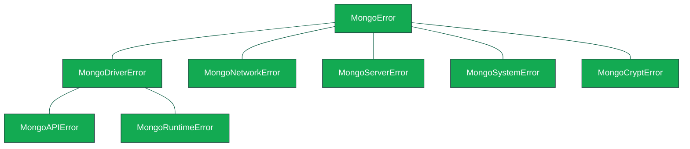

# Error Class Hierarchy

**Title**: Error Class Hierarchy

**Authors**: Warren James, Andy Mina

**Advisory Group**: Daria Purdue, Eric Adum, Neal Beeken

## Contents

- [Introduction](#Introduction)
- [Errors](#errors)
  - [`MongoError`](#MongoError)
  - [`MongoDriverError`](#MongoDriverError)
    - [`MongoAPIError`](#MongoAPIError)
    - [`MongoRuntimeError`](#MongoRuntimeError)
      - [`MongoUnexpectedServerResponseError`](#MongoUnexpectedServerResponseError)
  - [`MongoNetworkError`](#MongoNetworkError)
  - [`MongoServerError`](#MongoServerError)
  - [`MongoSystemError`](#MongoSystemError)
  - [`MongoCryptError`](#MongoCryptError)
- [Test Plan](#Test-Plan)
  - [`MongoAPIError`](#MongoAPIError-1)
    - [`MongoInvalidArgumentError`](#MongoInvalidArgumentError-1)
    - [`MongoMissingCredentialsError`](#MongoMissingCredentialsError-1)
    - [`MongoNotConnectedError`](#MongoNotConnectedError-1)
    - [`MongoTopologyClosedError`](#MongoTopologyClosedError-1)
    - [`MongoCursorExhaustedError`](#MongoCursorExhaustedError-1)
    - [`MongoServerClosedError`](#MongoServerClosedError-1)
  - [`MongoNetworkError`](#MongoNetworkError-1)
    - [`MongoNetworkTimeoutError`](#MongoNetworkTimeoutError-1)

## Errors

All errors are derived from the `MongoError` class which should **never** be instantiated.
There are five main error classes which stem from `MongoError`: `MongoDriverError`,
`MongoNetworkError`, `MongoServerError`, `MongoCryptError` and `MongoSystemError`.

### `MongoError`

The base class from which all errors in the Node driver subclass.
`MongoError` should **never** be be directly instantiated.

Children of `MongoError` include:

- [`MongoDriverError`](#MongoDriverError)
- [`MongoNetworkError`](#MongoNetworkError)
- [`MongoServerError`](#MongoServerError)
- [`MongoSystemError`](#MongoSystemError)
- [`MongoCryptError`](#MongoCryptError)

### `MongoDriverError`

This class represents errors which originate in the driver itself or when the user incorrectly uses the driver. This class should **never** be directly instantiated.
Its children are the main classes of errors that most users will interact with: [**`MongoAPIError`**](#MongoAPIError), [**`MongoRuntimeError`**](#MongoRuntimeError) and [**`MongoOperationTimeoutError`**](#MongoOperationTimeoutError).

### `MongoAPIError`

This class represents errors which originate from misuse of the driver API and will generally be thrown before making contact with the server.
This class should **never** be directly instantiated.

**Children of MongoAPIError**

| Error Name                         | Description                                                                                                                                            |
| ---------------------------------- | ------------------------------------------------------------------------------------------------------------------------------------------------------ |
| **MongoInvalidArgumentError**      | Thrown when the user supplies malformed or unexpected arguments or failed to provide a required argument or field.                                     |
| **MongoCompatibilityError**        | Thrown when a feature that is not enabled or allowed for the current server configuration is used.                                                     |
| **MongoMissingCredentialsError**   | Thrown when a user fails to provide authentication credentials before attempting to connect.                                                           |
| **MongoMissingDependencyError**    | Thrown when a required module or dependency is not present.                                                                                            |
| **MongoExpiredSessionError**       | Thrown when the user attempts to operate on a session that is expired or closed.                                                                       |
| **MongoTransactionError**          | Thrown when the user makes a mistake in the usage of transactions (e.g.: attempting to commit a transaction with a readPreference other than primary). |
| **MongoTailableCursorError**       | Thrown when the user calls a function or method that is not supported on a tailable cursor.                                                            |
| **MongoCursorExhaustedError**      | Thrown when an attempt is made to read from a cursor that is exhausted.                                                                                |
| **MongoCursorInUseError**          | Thrown when the user attempts to add options to an already initialized cursor.                                                                         |
| **MongoServerClosedError**         | Thrown when an attempt is made to operate on a closed server.                                                                                          |
| **MongoTopologyClosedError**       | Thrown when an attempt is made to operate on a dropped, or otherwise unavailable, database.                                                            |
| **MongoNotConnectedError**         | Thrown when the user attempts to perform operations on a client that has not yet connected.                                                            |
| **MongoBatchReExecutionError**     | Thrown when a user attempts to re-execute a batch command when one of the constituent commands has failed.                                             |
| **MongoConnectionStringError**     | Thrown when a user supplies an incorrect URI to the driver.                                                                                            |
| **MongoConnectionPoolClosedError** | Thrown when a user attempts to operate on a connection pool that is expired or closed.                                                                 |

### `MongoRuntimeError`

This class represents errors which occur when the driver encounters unexpected input or reaches an unexpected/invalid internal state.
This class should **never** be directly instantiated.

**Children of MongoRuntimeError**

| Error Name                  | Description                                                                                |
| --------------------------- | ------------------------------------------------------------------------------------------ |
| **MongoDecompressionError** | Thrown when the driver fails to decompress data received from the server.                  |
| **MongoChangeStreamError**  | Thrown when an error is encountered when operating on a ChangeStream.                      |
| **MongoGridFSStreamError**  | Thrown when an unexpected state is reached when operating on a GridFS Stream.              |
| **MongoGridFSChunkError**   | Thrown when a malformed or invalid chunk is encountered when reading from a GridFS Stream. |
| **MongoUnexpectedServerResponseError**   | Thrown when the driver receives a **parsable** response it did not expect from the server. |

### `MongoOperationTimeoutError`

The `MongoOperationTimeoutError` class represents an error that occurs when an operation could not be completed within the specified `timeoutMS`.
It is generated by the driver in support of the "client side operation timeout" feature and inherits from `MongoDriverError`.
When `timeoutMS` is enabled `MongoServerErrors` relating to `MaxTimeExpired` errors will be converted to `MongoOperationTimeoutError`.

### MongoUnexpectedServerResponseError

Intended for the scenario where the MongoDB returns an unexpected response in relation to some state the driver is in.
This error should **NOT** represent a response that couldn't be parsed due to errors in protocol formatting.

Ex. Server selection results in a feature detection change: this is not usually an unexpected response, but if while retrying an operation serverSelection returns a server with a lower wireVersion than expected, we can no longer proceed with the retry, so the response is unexpected in that case.

### `MongoNetworkError`

These are errors which prevent the driver from connecting to a mongo server instance. Children of this class include:

- #### `MongoNetworkTimeoutError`

  - Thrown when a timeout expires while attempting to connect to the mongo server

### `MongoServerError`

These are errors which wrap error responses received from the server.

### `MongoSystemError`

These are errors which originate from faulty environment setup.

- #### MongoServerSelectionError
  - Thrown when the driver fails to select a server to complete an operation

### `MongoCryptError`

These are errors thrown from the driver's client side encryption logic.

- #### MongoCryptInvalidArgumentError
  - Thrown when an invalid argument has been provided to an encryption API
- #### MongoCryptInvalidCreateDataKeyError
  - Thrown when the driver fails to create data keys for an encrypted collection
- #### MongoCryptInvalidCreateEncryptedCollectionError
  - Thrown when the driver fails to create an encrypted collection
- #### MongoCryptInvalidCreateAzureKMSRequestError
  - Thrown when the driver encounters an error when fetching Azure KMS credentials
- #### MongoCryptKMSRequestNetworkTimeoutError
  - Thrown when the HTTP request to the IDMS server times out when fetching Azure KMS credentials

## Test Plan

The test plan consists of a series of prose tests.
As numerous errors are being introduced, select classes will be tested.
The classes to be tested will be selected based on three characteristics:

1. The **frequency** with which users may encounter this error. Errors that users will likely run into, including but not limited to `MongoInvalidArgumentError` and `MongoNetworkTimeoutError`, are a part of the test plan. _Note:_ Error classes that should never be instantiated, such as `MongoAPIError` and `MongoRuntimeError`, will not be tested as the user should not encounter them.
2. The **scope** of the error. Errors that tackle a large subset of issues, including but not limited to `MongoServerError` and `MongoSystemError`, will _not_ be a part of the test plan.
3. The **existing coverage** of the error. Errors that are already covered in existing tests will _not_ be a part of the test plan to avoid redundancy.

### `MongoAPIError`

#### `MongoInvalidArgumentError`

- Create a `MongoClient` object and supply a number in place of the connection string when calling `.connect()`
  - Assert that `MongoInvalidArgumentError` is thrown.

#### `MongoMissingCredentialsError`

- Fail to provide credentials when authenticating with the x509 mechanism.
  - Assert that `MongoMissingCredentialsError` is thrown.

#### `MongoNotConnectedError`

- Attempt to access a database without establishing a connection to a MongoDB server.
  - Assert that `MongoNotConnectedError` is thrown.

#### `MongoTopologyClosedError`

- Attempt to execute `createCollection()` against a database that has been closed.
  - Assert that `MongoTopologyClosedError` is thrown.

#### `MongoCursorExhaustedError`

- Attempt to continue reading a cursor after it has reached the end of the batch.
  - Assert that `MongoCursorExhaustedError` is thrown.

#### `MongoServerClosedError`

- Attempt to execute a query against a server that has closed.
  - Assert that `MongoServerClosedError` is thrown.

### `MongoNetworkError`

#### `MongoNetworkTimeoutError`

- Create a `MongoClient` object and set the `connectTimeoutMS` option to 1.
  - Assert that a `MongoNetworkTimeoutError` is thrown.
